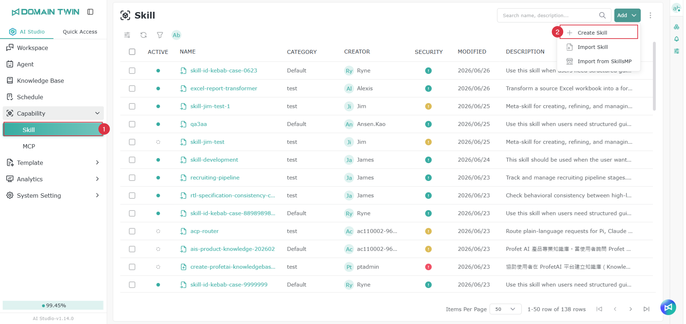

# 技能

## 簡介

透過新增不同的 Skill，Agent 可以執行更多特定任務，例如取得外部資訊、串接工具、處理特定流程，或完成原本無法直接執行的操作。你可以依照需求為 Agent 配置合適的 Skill，讓它在回應與執行任務時更靈活，也更貼近實際使用情境。

<figure><figcaption></figcaption></figure>

## 手動新增技能

<figure><figcaption></figcaption></figure>

<figure><figcaption></figcaption></figure>

1. 到 技能的分頁
2. 點擊 新增 ，選擇創建
3. 選擇分類的群組，亦可點及右邊+號新增群組
4. 左側為清單目錄，第一次新建技能時預設有一組不能刪除的資料夾和Skill.md，但可再另外新增資料夾以及檔案，新增的方式可參考[新增資料夾或檔案](ji-neng.md#xin-zeng-zi-liao-jia-huo-dang-an)
5. 依照格式填入檔案內容
6. 可點擊發布，完成建立

> 請注意 : 儲存不等於將內容發布到線上使用

### 匯入檔案

點擊左側清單上方的匯入檔案按鈕，並選擇要匯入的類型，分別有匯入檔案及匯入目錄。

<figure><figcaption></figcaption></figure>

### 新增資料夾 / 檔案

點擊左側清單上方，可選擇新增檔案或資料夾，根據選擇的類型輸入名稱。

> 注意 : 新增檔案時需要另外新增副檔名，例如 : readme.md。

<figure><figcaption></figcaption></figure>

### 編輯 / 刪除資料夾或檔案

將滑鼠懸停在準備編輯或刪除的資料上，右側出現會出現功能按鈕，使用者能根據需求做點擊使用

<figure><figcaption></figcaption></figure>

## 匯入技能

<figure><figcaption></figcaption></figure>

<figure><figcaption></figcaption></figure>

1. 到 技能的分頁
2. 點擊 新增 ，選擇匯入技能
3. 匯入指定格式檔案 ( 僅支援 **.zip, .md, .skill** )
4. 選擇分類的群組，亦可點及右邊+號新增群組
5. 點擊匯入，完成建立

## 從 SkillsMP 匯入技能

### 啟用 SkillsMP 匯入選項

<figure><figcaption></figcaption></figure>

<figure><figcaption></figcaption></figure>

<figure><figcaption></figcaption></figure>

<figure><figcaption></figcaption></figure>

若要在 AIS 中顯示 SkillsMP 匯入選項，請先完成以下設定：

1. 前往 SkillsMP 官方平台申請個人或企業帳號，建立一組 API Key
   * 申請網址：[https://skillsmp.com/docs/api](https://skillsmp.com/docs/api)
2. 回到 AIS，進入：
   &#x20;系統設定 → 密鑰管理
3. 點選 新增
4. 在 類型 欄位選擇：
   SkillsMP
5. 將從 SkillsMP 取得的 API Key 貼入指定欄位
6. 完成新增後，系統才會顯示 SkillsMP 匯入選項

> 注意 : SkillsMP 匯入功能需先完成 API Key 設定後才會顯示。若未在 Key Management 中新增 SkillsMP Provider 與對應的 API Key，系統將不會顯示 SkillsMP 匯入選項。

#### 使用限制

SkillsMP API 會依據是否使用 API Key，套用不同的請求限制：

1. 未使用 API Key
   * 每日最多可發送 50 次請求
   * 每分鐘最多可發送 10 次請求
   * 僅支援 關鍵字搜尋
2. 已使用 API Key
   * 每日最多可發送 500 次請求
   * 每分鐘最多可發送 30 次請求
   * 支援 關鍵字搜尋
3. 不支援萬用字元搜尋
   * SkillsMP API 不支援使用萬用字元進行搜尋，例如：\*
4. Quota 用量追蹤
   * 每一次 API 回應都會包含相關的 response headers，可用於追蹤目前的 quota 使用狀況

### 在 AIS 內使用 SkillsMP 匯入技能

<figure><figcaption></figcaption></figure>

<figure><figcaption></figcaption></figure>

1. 到技能分頁
2. 點擊添加，選擇 從 SkillsMP 匯入
3. 選擇群組
4. 選擇技能，點擊 + 號匯入

## 檢視安全等級

每一筆技能匯入後，系統都會自動掃描一遍，並給予不同的安全等級分類。使用者可點擊圖標檢視詳細內容。

<figure><figcaption></figcaption></figure>

<figure><figcaption></figcaption></figure>

### 安全等級判定

目前安全等級的判定是依據 **OWASP Top 10 for LLM** 相關規範進行檢查與評估。

參考資料：[https://genai.owasp.org/llm-top-10/](https://genai.owasp.org/llm-top-10/)

### 技能掃描規則

技能掃描規則用於設定技能掃描時使用的模型與檢查規則。此功能可協助系統在技能建立或匯入時，檢查技能內容是否符合平台規範，降低不安全設定、異常行為或不符合預期內容被使用的風險。

此功能預設為啟用狀態。若無特殊需求，建議保留系統預設設定。

> 若有設定的需求，**AI Studio 管理員**可依照以下路徑進入設定頁面：
>
> 系統設定 → 配置 → 技能掃描設定

## 使用技能

使用的位置分別有兩處 :

* **Agent → 左側 Skill 設定**

<figure><figcaption></figcaption></figure>

<figure><figcaption></figcaption></figure>

* **Workflow → LLM Node → Skill 設定**

<figure><figcaption></figcaption></figure>

<figure><figcaption></figcaption></figure>

## 權限

清單權限說明請參照 [模組權限角色介紹- 技能清單權限](../ru-men-zhi-nan/quan-xian-gong-neng-jie-shao.md#ji-neng-qing-dan) 。

權限設定說明請參照 [權限操作功能介紹- Root 權限](../ru-men-zhi-nan/quan-xian-cao-zuo-gong-neng-jie-shao.md#root-quan-xian) 。

### 技能權限

角色權限說明請參照 [模組權限角色介紹- 技能權限](../ru-men-zhi-nan/quan-xian-gong-neng-jie-shao.md#ji-neng) 。

權限設定說明請參照 [權限操作功能介紹- Object 角色權限](../ru-men-zhi-nan/quan-xian-cao-zuo-gong-neng-jie-shao.md#jue-se-quan-xian) 。

